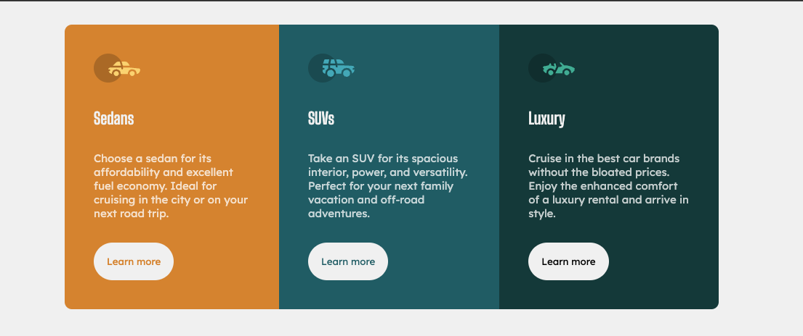
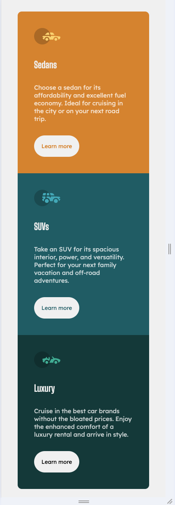

# Frontend Mentor - 3-column preview card component solution

This is a solution to the [3-column preview card component challenge on Frontend Mentor](https://www.frontendmentor.io/challenges/3column-preview-card-component-pH92eAR2-). Frontend Mentor challenges help you improve your coding skills by building realistic projects.

## Table of contents

-   [Overview](#overview)
    -   [The challenge](#the-challenge)
    -   [Screenshot](#screenshot)
    -   [Links](#links)
-   [My process](#my-process)
    -   [Built with](#built-with)
    -   [What I learned](#what-i-learned)
    -   [Continued development](#continued-development)
    -   [Useful resources](#useful-resources)
-   [Author](#author)
-   [Acknowledgments](#acknowledgments)

**Note: Delete this note and update the table of contents based on what sections you keep.**

## Overview

### The challenge

Users should be able to:

-   View the optimal layout depending on their device's screen size
-   See hover states for interactive elements

### Screenshot

### Links

-   Solution URL: [GitHub](https://github.com/CharlieDW/FE-Mentor.3_column_preview_card)
-   Live Site URL: [GitHub pages](https://charliedw.github.io/FE-Mentor.3_column_preview_card/)

## My process

### Built with

-   Semantic HTML5 markup
-   CSS custom properties
-   Flexbox
-   Mobile-first workflow

### What I learned

After a couple of years of sole development on the ServiceNow platform, I decided to start working on some front end geared projects through Frontend Mentor and realized how much fun it is to work with these technogologies. Currently still only using vanilla CSS.

### Continued development

I want to get back to SCSS for future projects as I remember it helps a lot with structuring code in readable ways.

### Useful resources

-   [Bootstrap Breakpoints](https://getbootstrap.com/docs/5.0/layout/breakpoints/) - This helped me a lot to decide on which breakpoints to set my media queries. I know Bootstrap is not perfect when it comes to handling media queries, but it was definitely a start for me :)

## Author

-   GitHub - [CharlieDW](https://github.com/CharlieDW)
-   Frontend Mentor - [@CharlieDW](https://www.frontendmentor.io/profile/CharlieDW)

## Acknowledgments

Seeing [@NullishKoala](https://www.frontendmentor.io/profile/NullishKoala) completing these challenges and writing about her experience with them on LinkedIn inpsired me to get started as well.
